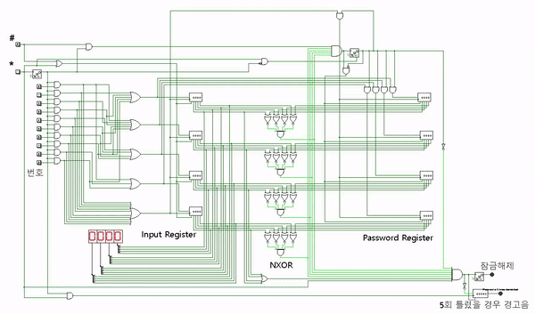

# Digital-Door-Lock-Circuit-Design
This is the final project of the Computer System Design class at Seoul National University of Science and Technology (SeoulTech). The designed digital door lock circuit features checking and changing password. This is developed using [Logisim](http://www.cburch.com/logisim/).

  
(Click the image and watch the demo on Youtube.)
